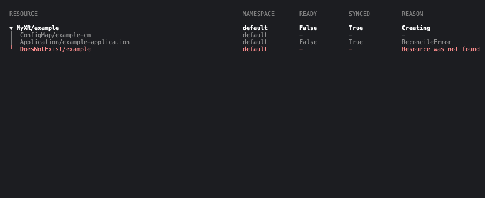

## xrefs

A CLI tool (and k9s plugin) to quickly view and navigate through sub-resources of Kubernetes resources like Crossplane claims or Flux kustomizations.

The latest refactor is inspired by the [Crossplane](https://github.com/crossplane/crossplane) `beta trace` command.

## Install

```sh
go install github.com/nkzk/xrefs@latest
```

## Usage

```sh
xrefs view <kind>.<version>.<api-group>/<name> [flags]
```




### Examples

```sh
xrefs view my-xr.v1alpha1.example.io/name
xrefs view my-xr.v1alpha1.example.io/name -n my-namespace
```

## k9s plugin

I've added a helper command to help you install the cli as a k9s plugin. 

This allows you to use the cli via a shortcut while selecting a resource in k9s, so you dont need to manage the cli args yourself.

The k9s plugin config is appended only, and a backup is saved to the /tmp directory.

### Install plugin

```sh
xrefs k9s install
```

### Usage in k9s

1. Navigate to an XR in k9s
2. Press `Shift+G` to show XR resource references
3. Navigate to a resource, press `y` for yaml
4. Press `Esc`/`q` to quit yaml, or `Ctrl+C` to quit the whole program

Vim navigation commands are supported (hjkl)

A help text is shown at the bottom for available commands.
